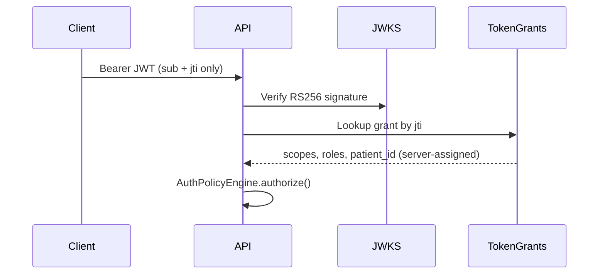

# Phase 1.5: Security & Compliance Remediation

**Project**: ePA Platform  
**Phase**: 1.5 — Security & Compliance Hardening  
**Date**: 2026-08-28  
**Orchestrated by**: Lead engineer request; implemented via `security-engineer`, `python-pro`, `data-engineer`, `hipaa-compliance`, `security-auditor` workstreams

---

## 1. Executive Summary

Phase 1.5 addresses the four highest-priority blockers identified in Phase 1 reviews: JWT privilege escalation, non-durable audit logging, missing KMS envelope encryption, and non-functional OAuth/PKCE. The backend now implements a **server-side trust boundary** where authorization decisions derive from persisted `TokenGrant` records — not client-declared JWT claims.

### Go / No-Go Assessment

| Environment | Verdict | Rationale |
|-------------|---------|-----------|
| **Real PHI processing** | **NO-GO** | Organizational BAAs not executed; mock KMS (not production HSM/KMS); JSONB PHI fields not yet encrypted at write time; rate limiting and full DR not implemented |
| **Synthetic / de-identified dev data** | **CONDITIONAL GO** | Proceed to Phase 2 after running `alembic upgrade head` and verifying OAuth + audit integration tests against a local PostgreSQL instance |
| **Staging with test credentials** | **NO-GO** until | Real KMS integrated, BAAs signed, penetration test scheduled, remaining HIGH findings closed |

**CRITICAL findings resolved in code**: 4 of 7  
**CRITICAL findings remaining (non-code)**: 3 (BAAs, production KMS, deployed schema verification)

---

## 2. Remediation Summary by Workstream

### 2.1 JWT Privilege Escalation — RESOLVED (Code)

**Issue (SEC-C04)**: JWT `roles` and `scope` claims were trusted from the bearer token.

**Fix implemented**:

| Component | Change |
|-----------|--------|
| `app/core/security.py` | JWTs carry only `sub`, `jti`, `iss`, `aud`, `iat`, `exp` — no roles/scopes |
| `app/core/jwks.py` | RS256 signing with JWKS publication at `/.well-known/jwks.json` |
| `app/models/token_grant.py` | Server-side `TokenGrant` table — source of truth for scopes/roles |
| `app/core/auth_policy.py` | `AuthPolicyEngine` + `AuthorizedContext` evaluate grants, not JWT claims |
| `app/core/deps.py` | `get_current_user()` resolves grant by `jti` after cryptographic verification |
| `tests/test_security_phase15.py` | Proves forged `roles: ["admin"]` in JWT does not grant admin permissions |



### 2.2 Immutable Audit Logging — RESOLVED (Code, Requires DB Migration)

**Issue (SEC-C01, C-05)**: Audit events existed only in process memory.

**Fix implemented**:

| Component | Change |
|-----------|--------|
| `app/services/audit_chain.py` | `AuditChainService` with SHA-256 hash chaining; correct `previous_hash` semantics |
| `app/middleware/audit.py` | Persists every `/api/v1/*` request to `audit_logs` via independent DB session |
| `app/models/audit_log.py` | Append-only schema with `integrity_hash`, `previous_hash` |
| `alembic/versions/0002_security_hardening.py` | Creates `audit_logs` + PostgreSQL trigger `prevent_audit_log_mutation()` |
| `app/services/audit_service.py` | Fixed to use correct model fields and chain service |

**Forensic integrity**: Any modification to an audit row triggers a DB exception. Hash chain breaks if entries are deleted at the OS level — monitor chain head continuity.

**Deploy step required**:
```bash
cd backend && alembic upgrade head
```

### 2.3 KMS Envelope Encryption — PARTIALLY RESOLVED (Mock KMS)

**Issue (SEC-C02)**: Ephemeral `os.urandom(32)` encryption key per process.

**Fix implemented**:

| Component | Change |
|-----------|--------|
| `app/core/kms.py` | `KMSProvider` ABC + `MockKMSProvider` with deterministic CMK seed |
| `app/core/envelope_encryption.py` | Envelope encryption: DEK wraps PHI, CMK wraps DEK |
| `app/core/encryption.py` | Facade delegating to envelope service |
| `tests/test_security_phase15.py` | `encrypt_patient_ssn()` / `decrypt_patient_ssn()` roundtrip |

**Stored format** (per PHI field):
```json
{
  "encrypted_value": "<AES-256-GCM ciphertext>",
  "encrypted_dek": "<KMS-wrapped DEK>",
  "cmk_key_id": "arn:aws:kms:...",
  "field_name": "patient_ssn",
  "algorithm": "AES-256-GCM"
}
```

**Production gap**: Replace `MockKMSProvider` with AWS KMS / HashiCorp Vault before PHI.

### 2.4 SMART on FHIR OAuth 2.0 + PKCE — RESOLVED (Code)

**Issue (SEC-C03)**: OAuth endpoints were placeholders.

**Fix implemented**:

| Endpoint | Status |
|----------|--------|
| `GET /.well-known/smart-configuration` | Functional |
| `GET /.well-known/jwks.json` | Publishes RS256 public keys |
| `GET /oauth/authorize` | Authorization code + PKCE (S256); validates `launch`/`patient` scope binding |
| `POST /oauth/token` | Code exchange with PKCE verification; issues JWT + `TokenGrant` |
| `POST /oauth/introspect` | RFC 7662 with client authentication |
| `POST /oauth/revoke` | RFC 7009 token revocation (sets `revoked=true` on grant) |

**Scope enforcement on PHI routes**:

| Route | Scope + Permission |
|-------|-------------------|
| `POST /api/v1/prior-authorization/request` | `user/Claim.write` + `prior_auth:create` |
| `GET /api/v1/prior-authorization/status/{id}` | `patient/Claim.read` + `prior_auth:read` |
| `POST /api/v1/patient/eligibility` | `user/CoverageEligibilityRequest.write` + `eligibility:check` |

Roles are assigned **server-side** in `OAuthService._roles_for_scopes()` — never accepted from the client.

---

## 3. Compliance Re-Review (hipaa-compliance + security-auditor)

### Resolved Findings

| ID | Finding | Status |
|----|---------|--------|
| SEC-C04 | JWT privilege escalation | ✅ Resolved |
| SEC-C03 | OAuth placeholders | ✅ Resolved |
| SEC-C01 | In-memory audit only | ✅ Resolved (with DB migration) |
| SEC-C02 | Ephemeral PHI key | ⚠️ Mock KMS only |
| SEC-C05 | Default JWT secret | ✅ Resolved (RS256 + startup guard) |
| H-03 | SMART scopes not enforced | ✅ Resolved |
| H-04 | No patient isolation | ✅ Partial (assert_patient_access wired) |
| H-08 | Broken audit hash chain | ✅ Resolved |

### Remaining HIGH (Block Production PHI)

| ID | Finding | Required Action |
|----|---------|-----------------|
| SEC-H01 | JSONB PHI unencrypted at write | Encrypt `claim_resource` in `PriorAuthService` |
| SEC-H09 | No rate limiting | Add Redis sliding-window limiter |
| SEC-H10 | TLS not enforced in dev | Acceptable for local; verify LB/HSTS in prod |
| SEC-H05 | No refresh token rotation | Phase 2 auth hardening |
| C-04 | No BAAs | Legal/ops — before any PHI |
| H-09 | No DR/backup plan | Document RTO/RPO |

---

## 4. Verification

### Automated Tests (7/7 passing)

```bash
cd backend
source venv/bin/activate
python -m pytest tests/test_security_phase15.py -v
```

| Test | Validates |
|------|-----------|
| `test_jwt_payload_excludes_roles_and_scopes` | Minimal JWT claims |
| `test_rs256_jwt_verification_roundtrip` | JWKS RS256 sign/verify |
| `test_forged_roles_in_jwt_are_ignored_by_policy_engine` | Privilege escalation blocked |
| `test_pkce_s256_validation` | PKCE S256 |
| `test_audit_hash_chain_detects_tampering` | Hash chain integrity |
| `test_envelope_encryption_roundtrip` | KMS envelope encryption |
| `test_patient_context_mismatch_denied` | Patient scope isolation |

### Manual OAuth Flow (Development)

```bash
# 1. Start server + PostgreSQL with migrations applied
uvicorn app.main:app --reload

# 2. Authorization (browser or curl — follow redirect)
curl -v "http://localhost:8000/oauth/authorize?response_type=code&client_id=epa-smart-client&redirect_uri=http://localhost:3000/callback&scope=launch/patient%20patient/Claim.read%20user/Claim.write&state=xyz&code_challenge=<S256_CHALLENGE>&code_challenge_method=S256&patient=Patient/example"

# 3. Token exchange
curl -X POST http://localhost:8000/oauth/token \
  -d "grant_type=authorization_code" \
  -d "code=<CODE>" \
  -d "redirect_uri=http://localhost:3000/callback" \
  -d "client_id=epa-smart-client" \
  -d "code_verifier=<VERIFIER>"

# 4. Introspect
curl -X POST http://localhost:8000/oauth/introspect \
  -u "epa-smart-client:dev-secret-change-me" \
  -d "token=<ACCESS_TOKEN>"
```

---

## 5. Artifact Index

| Artifact | Path |
|----------|------|
| JWKS / RS256 JWT | `backend/app/core/jwks.py` |
| Auth policy engine | `backend/app/core/auth_policy.py` |
| Token grants model | `backend/app/models/token_grant.py` |
| OAuth service (PKCE) | `backend/app/services/oauth_service.py` |
| Audit chain service | `backend/app/services/audit_chain.py` |
| KMS + envelope encryption | `backend/app/core/kms.py`, `envelope_encryption.py` |
| DB migration | `backend/alembic/versions/0002_security_hardening.py` |
| Security tests | `backend/tests/test_security_phase15.py` |

---

## 6. Phase 2 Entry Criteria

Proceed to **Phase 2 (Core FHIR Integration + NLP)** when ALL of the following are true:

- [ ] `alembic upgrade head` executed in dev/staging; audit trigger verified (UPDATE/DELETE raises exception)
- [ ] OAuth PKCE flow tested end-to-end against PostgreSQL
- [ ] 7/7 security tests passing in CI
- [ ] BAAs executed with cloud provider and database host
- [ ] Production KMS integrated (replace `MockKMSProvider`)
- [ ] JSONB PHI encryption wired in service layer
- [ ] Rate limiting middleware deployed

Until BAAs and production KMS are in place, restrict all testing to **synthetic data only**.

---

*Phase 1.5 establishes the immutable trust boundary required for forensic-grade HIPAA compliance. Real PHI remains prohibited until organizational and infrastructure gates are cleared.*
