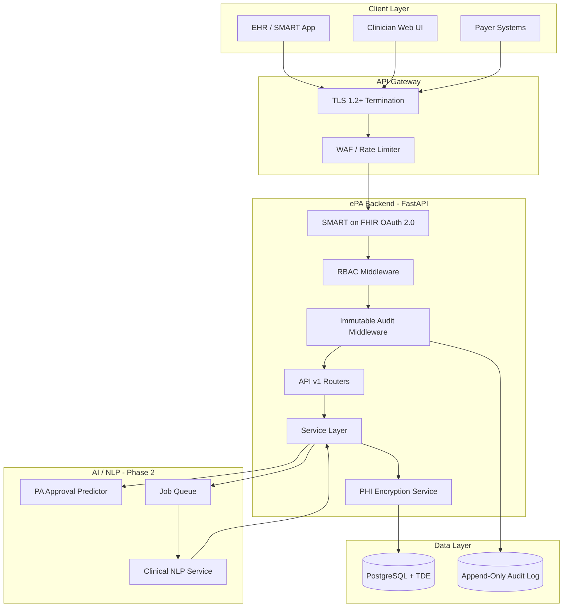

# Phase 1 Architecture & Compliance Scaffolding

**Project**: ePA Platform — HIPAA-Compliant Electronic Prior Authorization  
**Phase**: 1 — Architecture & Compliance Scaffolding  
**Date**: 2026-08-28  
**Status**: Scaffold Complete — **NOT production-ready for PHI**

---

## 1. Executive Summary

Phase 1 establishes the architectural foundation for an AI-driven, FHIR R4-compliant electronic Prior Authorization platform. Five specialist subagents contributed:

| Subagent | Deliverable | Location |
|----------|-------------|----------|
| `api-designer` | OpenAPI 3.1 + FHIR R4 specification with SMART on FHIR OAuth 2.0 | `backend/openapi/` |
| `python-pro` | FastAPI backend scaffold with DI, SQLAlchemy models, JWT/RBAC, audit middleware | `backend/app/` |
| `nlp-engineer` | Clinical NLP extraction architecture for physician notes → FHIR | `docs/nlp/` |
| `hipaa-compliance` | HIPAA Security Rule gap analysis | `docs/compliance/HIPAA_COMPLIANCE_REVIEW.md` |
| `security-auditor` | Security findings and remediation priorities | `docs/compliance/SECURITY_AUDIT_REPORT.md` |

**Verdict**: Architecture is directionally correct for HIPAA compliance. Critical implementation gaps must be resolved before processing any Protected Health Information.

---

## 2. System Architecture



---

## 3. API Design (`api-designer`)

### Core Endpoints

| Method | Path | FHIR Resources | Auth Scope |
|--------|------|---------------|------------|
| `POST` | `/api/v1/prior-authorization/request` | `Claim` (preauth), `ClaimResponse` | `user/Claim.write` |
| `GET` | `/api/v1/prior-authorization/status/{id}` | `ClaimResponse`, AI prediction | `user/Claim.read` |
| `POST` | `/api/v1/patient/eligibility` | `CoverageEligibilityRequest/Response` | `user/CoverageEligibilityRequest.write` |

### SMART on FHIR OAuth 2.0

| Endpoint | Purpose |
|----------|---------|
| `/.well-known/smart-configuration` | Capability discovery |
| `/oauth/authorize` | Authorization code flow with PKCE (S256) |
| `/oauth/token` | Token issuance (authorization_code, client_credentials, refresh_token) |
| `/oauth/introspect` | RFC 7662 token introspection |
| `/oauth/revoke` | RFC 7009 token revocation |

**Scopes defined**: `launch/patient`, `patient/Patient.read`, `patient/Coverage.read`, `user/CoverageEligibilityRequest.write`, `user/Claim.write`, `system/Claim.write`, `system/AuditEvent.read`

**Audit headers**: Every PHI response includes `X-Request-Id` and `X-Audit-Event-Id` for immutable trail correlation.

Full specification: [`backend/openapi/epa-platform-v1.yaml`](backend/openapi/epa-platform-v1.yaml)

---

## 4. Backend Scaffold (`python-pro`)

### Directory Structure

```
backend/
├── app/
│   ├── main.py                     # App factory, middleware stack
│   ├── core/
│   │   ├── config.py               # Pydantic settings
│   │   ├── database.py             # Async SQLAlchemy
│   │   ├── deps.py                 # DI: auth, DB, RBAC guards
│   │   ├── security.py             # JWT encode/decode
│   │   ├── encryption.py           # AES-256-GCM PHI encryption
│   │   └── rbac.py                 # Role → permission mapping
│   ├── middleware/
│   │   ├── audit.py                # Hash-chained audit events
│   │   └── request_context.py      # Correlation ID propagation
│   ├── models/
│   │   ├── audit_log.py            # Append-only audit table
│   │   ├── patient.py              # Encrypted PHI columns
│   │   ├── prior_auth.py           # PA tracking + AI scores
│   │   └── user.py                 # Auth + roles
│   ├── schemas/fhir.py             # Pydantic FHIR models
│   ├── api/v1/endpoints/           # Route handlers
│   └── services/                   # Business logic
├── openapi/                        # API specification
├── alembic/                        # DB migrations
└── pyproject.toml
```

### Key Design Decisions

- **Async-first**: SQLAlchemy 2.0 async with `asyncpg` for PostgreSQL
- **Dependency injection**: `require_permission()` and `require_scope()` as FastAPI dependencies
- **Layered security**: TLS → JWT → RBAC → Audit, applied via middleware stack
- **PHI separation**: Identifiable fields encrypted individually; MRN stored as HMAC token for lookup

---

## 5. Clinical NLP Architecture (`nlp-engineer`)

Unstructured physician notes (Progress Notes, H&P) are processed through a self-hosted NLP pipeline:

1. **Ingestion** → Document parsing, section segmentation
2. **NER** → BioClinicalBERT + scispaCy (no external PHI API calls)
3. **Entity Linking** → UMLS → ICD-10 / CPT / RxNorm
4. **FHIR Assembly** → `CoverageEligibilityRequest` with linked resources
5. **Validation** → FHIR profile validator + business rules
6. **Human Review** → Required when confidence < 0.85

Integration: async job queue (Celery/Redis) with callback to backend API.

Full architecture: [`docs/nlp/CLINICAL_NLP_ARCHITECTURE.md`](docs/nlp/CLINICAL_NLP_ARCHITECTURE.md)

---

## 6. Compliance & Security Review

### HIPAA Compliance Posture

| Control Area | Status | Notes |
|-------------|--------|-------|
| Access Control (RBAC) | 🟡 Designed | Roles/permissions defined; OAuth stubs not functional |
| Audit Controls | 🔴 Gap | Middleware computes events but does not persist |
| Integrity | 🟡 Designed | Hash chain designed; not DB-enforced |
| Encryption at Rest | 🔴 Gap | Ephemeral encryption key; JSONB PHI unencrypted |
| Transmission Security | 🟡 Partial | OpenAPI uses HTTPS URLs; app has no HTTPS redirect/HSTS — relies on external LB |
| Authentication | 🔴 Gap | OAuth/JWT placeholders only; default JWT secret with no startup guard |
| Minimum Necessary | 🟡 Partial | SMART scopes defined in spec; `require_scope()` not wired on routes |

### Security Risk Summary

Consolidated from [hipaa-compliance](b2794367-46d3-4eea-b052-fe23da76ba61) and [security-auditor](b5e27da5-504b-4d72-85e0-9a95c89bebfc) reviews — full detail in `docs/compliance/`.

| Severity | Count | Status |
|----------|-------|--------|
| CRITICAL | 7 | Must fix before any PHI |
| HIGH | 14 | Must fix before production |
| MEDIUM | 4+ | Fix before go-live |
| LOW | 2+ | Address in hardening sprint |

---

## 7. IMMEDIATE ACTION REQUIRED — Lead Engineer

The following items require your **immediate attention** before proceeding to Phase 2 or processing any test PHI:

### CRITICAL (Block all PHI processing)

| # | Risk | Owner Action |
|---|------|-------------|
| 1 | **Audit logs not persisted** — HIPAA audit trail exists only in memory | Implement async DB write in `AuditMiddleware`; add PostgreSQL triggers preventing UPDATE/DELETE on `audit_logs` |
| 2 | **PHI encryption key is ephemeral** — data loss on restart | Integrate KMS (AWS KMS / Vault); implement envelope encryption with key rotation |
| 3 | **OAuth2 endpoints are non-functional stubs** — no real authentication | Implement authorization code + PKCE flow, token issuance, and introspection |
| 4 | **No BAAs executed** — legal basis for PHI processing absent | Execute BAAs with cloud provider, database host, and all subprocessors |
| 5 | **Database schema not deployed** — Alembic migration is a no-op | Ship initial migration with audit immutability triggers and RLS policies |
| 6 | **Default JWT secret with no startup guard** — weak placeholder in config | Fail-fast on boot in non-dev; integrate secrets manager |
| 7 | **JWT roles/scopes trusted from token** — privilege escalation via forged claims | Resolve roles/scopes server-side at issuance only; validate against grant record at request time |

### HIGH (Block production deployment)

| # | Risk | Owner Action |
|---|------|-------------|
| 7 | FHIR JSONB columns store unencrypted PHI | Encrypt JSONB contents or use encrypted blob storage |
| 8 | SMART scopes not enforced on routes (`require_scope()` unused) | Wire scope checks to match OpenAPI contract |
| 9 | No patient/tenant access isolation on PA status reads | Enforce caller `patient` context and org boundaries |
| 10 | Audit log incomplete — wrong hash chain, missing resource IDs, broken `AuditService` | Fix middleware persistence; repair `AuditService` model field mapping |
| 11 | No rate limiting on PHI endpoints | Implement Redis-backed rate limiter |
| 12 | Error responses may leak PHI via `OperationOutcome.diagnostics` | Sanitize all client-facing error messages |
| 13 | No backup/disaster recovery plan | Document and implement RTO/RPO per HIPAA §164.308(a)(7) |
| 14 | NLP queue security unspecified (Celery/Redis PHI in transit) | mTLS + encrypted payloads before NLP Phase 2 |

---

## 8. Phase 2 Roadmap

| Priority | Work Item | Dependency |
|----------|-----------|------------|
| P0 | Resolve all CRITICAL security/compliance gaps | — |
| P0 | Complete OAuth2 + JWT implementation | CRITICAL #3, #4 |
| P0 | Persist immutable audit log with DB triggers | CRITICAL #1 |
| P1 | KMS-backed PHI encryption | CRITICAL #2 |
| P1 | Initial Alembic migration (schema creation) | Encryption ready |
| P1 | FHIR profile validation integration | API spec finalized |
| P2 | Clinical NLP service implementation | Backend API stable |
| P2 | AI approval likelihood model integration | PA submission flow working |
| P2 | EHR SMART on FHIR launch integration | OAuth complete |
| P3 | Penetration test + HIPAA risk assessment documentation | All P0/P1 complete |

---

## 9. Artifact Index

| Artifact | Path |
|----------|------|
| OpenAPI Specification | `backend/openapi/epa-platform-v1.yaml` |
| FHIR Resource Mappings | `backend/openapi/fhir-profiles/README.md` |
| Backend Application | `backend/app/` |
| Backend README | `backend/README.md` |
| Environment Template | `backend/.env.example` |
| Clinical NLP Architecture | `docs/nlp/CLINICAL_NLP_ARCHITECTURE.md` |
| HIPAA Compliance Review | `docs/compliance/HIPAA_COMPLIANCE_REVIEW.md` |
| Security Audit Report | `docs/compliance/SECURITY_AUDIT_REPORT.md` |

---

## 10. How to Run (Development Only)

```bash
cd backend
source venv/bin/activate   # or: python -m venv venv && source venv/bin/activate
pip install -e ".[dev]"
cp .env.example .env
uvicorn app.main:app --reload --port 8000
```

> **Warning**: This scaffold uses placeholder secrets and non-functional auth. Do not expose to networks handling real PHI.

---

*Generated by orchestrating `api-designer`, `python-pro`, `nlp-engineer`, `hipaa-compliance`, and `security-auditor` subagents for Phase 1.*
