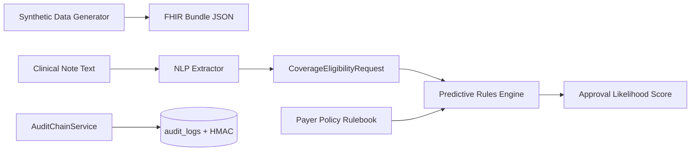

# Phase 2: Core Pipeline — Synthetic Data, NLP & Prediction

**Project**: ePA Platform  
**Phase**: 2 — Core FHIR Integration & NLP Pipeline (Synthetic Data Only)  
**Date**: 2026-08-28  
**Prerequisite**: Phase 1.5 CONDITIONAL GO — migrations applied, 10/10 tests passing

---

## 1. Executive Summary

Phase 2 delivers the core functional value of the ePA platform using **strictly synthetic data**:

| Component | Status | Location |
|-----------|--------|----------|
| Synthetic FHIR R4 generator | ✅ Complete | `backend/scripts/synthetic_data_generator.py` |
| Clinical NLP extraction (rule-based) | ✅ Complete | `backend/app/services/nlp_extractor.py` |
| Predictive rules engine | ✅ Complete | `backend/app/services/prediction_engine.py` |
| HMAC-signed audit segments | ✅ Complete | `backend/app/services/audit_chain.py` |
| API endpoints | ✅ Complete | `/api/v1/nlp/extract`, `/api/v1/prior-authorization/predict` |

**Data classification**: All generated and processed data is synthetic. No real PHI.

---

## 2. Architecture



---

## 3. Synthetic Data Generation

### Script

```bash
cd backend
source venv/bin/activate
python scripts/synthetic_data_generator.py --count 5 --output data/synthetic
```

### Output Files

| File | Contents |
|------|----------|
| `data/synthetic/synthetic_fhir_bundle.json` | FHIR R4 Bundle with Patient, Practitioner, Coverage, Organization, Claim, DocumentReference |
| `data/synthetic/synthetic_clinical_notes.json` | Array of synthetic clinical note strings |

### Resource Types Generated

- **Patient** — fake names (Synth, Testman), MRN `MRN-SYN-XXXXXX`, synthetic DOB/address
- **Practitioner** — synthetic NPI
- **Coverage** — linked to mock payers (Aetna/UHC/BCBS synthetic)
- **Claim** — preauthorization use, CPT 63030, ICD-10 M51.26
- **DocumentReference** — embeds clinical note text

> PHI column models (`encrypted_*` on `PatientRecord`) remain ready for envelope encryption when real data is introduced.

---

## 4. Clinical NLP Extraction Pipeline

### Approach

Rule-based regex extraction — **no external API calls**, suitable for synthetic data and HIPAA-safe local development.

### Extracted Entity Types

| Type | Example | Code System |
|------|---------|-------------|
| `condition` | Lumbar disc herniation | ICD-10-CM |
| `procedure` | microdiscectomy | CPT |
| `medication` | semaglutide | RxNorm |
| `conservative_therapy` | 8 weeks PT | — |
| `clinical_justification` | Conservative treatment failure | — |

### API Endpoint

```http
POST /api/v1/nlp/extract
Authorization: Bearer <token>
Content-Type: application/json

{
  "clinical_note": "MRI confirms L4-L5 disc herniation. Patient completed 8 weeks of conservative physical therapy without improvement. Requesting lumbar microdiscectomy (CPT 63030).",
  "patient_reference": "Patient/synth-patient-0000",
  "insurer_reference": "Organization/payer-aetna-synth"
}
```

### Example Response

```json
{
  "entities": [
    {"entity_type": "condition", "text": "Lumbar disc herniation", "code": "M51.26", "confidence": 0.92},
    {"entity_type": "procedure", "text": "Laminotomy", "code": "63030", "confidence": 0.88},
    {"entity_type": "conservative_therapy", "text": "8 weeks conservative therapy", "confidence": 0.90}
  ],
  "conservative_therapy_weeks": 8,
  "coverage_eligibility_request": { "resourceType": "CoverageEligibilityRequest", "...": "..." },
  "confidence_score": 0.893
}
```

---

## 5. Predictive Rules Engine

### Rulebook

Mock payer policies in `backend/data/payer_policy_rulebook.json`:

| Policy ID | Domain | Key Requirements |
|-----------|--------|-----------------|
| `spine-surgery-lumbar` | Spine surgery | ≥6 weeks failed conservative therapy, imaging, CPT 63030/63047 |
| `glp1-diabetes` | GLP-1 agonists | Type 2 DM, step therapy (metformin) |
| `biologic-asthma` | Asthma biologics | Moderate persistent asthma, ICS/LABA trial |

### API Endpoint

```http
POST /api/v1/prior-authorization/predict
Authorization: Bearer <token>
Content-Type: application/json

{
  "clinical_note": "MRI confirms L4-L5 disc herniation. Patient completed 8 weeks of conservative physical therapy without improvement. Requesting lumbar microdiscectomy (CPT 63030)."
}
```

### Example Response

```json
{
  "approval_likelihood_score": 85.0,
  "policy_id": "spine-surgery-lumbar",
  "policy_name": "Lumbar Spine Surgery Prior Authorization",
  "matched_criteria": [
    "Conservative therapy 8 weeks (≥6 required)",
    "Imaging study referenced in clinical note",
    "Required entity present: condition"
  ],
  "documentation_gaps": [
    {"code": "DOC_GAP", "description": "Provider NPI and specialty", "severity": "recommended"}
  ],
  "scoring_breakdown": {
    "conservative_therapy_met": 30,
    "has_imaging": 25
  },
  "recommendation": "Likely approved — criteria substantially met",
  "coverage_eligibility_request": { "...": "..." }
}
```

---

## 6. Forensic Audit Enhancement (HMAC)

Each audit log entry now includes:

| Field | Purpose |
|-------|---------|
| `previous_hash` | SHA-256 chain link to prior entry |
| `integrity_hash` | SHA-256 of current event payload |
| `integrity_hmac` | HMAC-SHA256 server-signed segment for non-repudiation |

### Verification (forensic tooling)

```python
from app.services.audit_chain import verify_audit_entry
from app.models.audit_log import AuditLog

# Returns True if hash chain + HMAC are valid
verify_audit_entry(audit_log_row)
```

Configure via `.env`:
```
AUDIT_HMAC_ENABLED=true
AUDIT_HMAC_SECRET=<strong-secret-from-vault>
```

> RFC 3161 timestamping can be added in Phase 3 for third-party trusted timestamps.

---

## 7. Local Development Setup

### Prerequisites

PostgreSQL running (Docker example already provisioned):
```bash
docker run -d --name epa-postgres \
  -e POSTGRES_USER=epa -e POSTGRES_PASSWORD=changeme \
  -e POSTGRES_DB=epa_platform -p 5432:5432 postgres:16-alpine
```

### Initialize

```bash
cd backend
source venv/bin/activate
cp .env.example .env
alembic upgrade head
python scripts/synthetic_data_generator.py --count 5
python -m pytest tests/ -v
uvicorn app.main:app --reload --port 8000
```

### Obtain Access Token (OAuth PKCE flow)

```bash
# Generate PKCE pair
python -c "
import hashlib, base64, secrets
v = secrets.token_urlsafe(32)
c = base64.urlsafe_b64encode(hashlib.sha256(v.encode()).digest()).rstrip(b'=').decode()
print('verifier:', v); print('challenge:', c)
"

# 1. Authorize (follow redirect to get code)
open "http://localhost:8000/oauth/authorize?response_type=code&client_id=epa-smart-client&redirect_uri=http://localhost:3000/callback&scope=launch/patient%20patient/Claim.read%20user/Claim.write%20user/CoverageEligibilityRequest.write&state=xyz&code_challenge=CHALLENGE&code_challenge_method=S256&patient=Patient/synth-patient-0000"

# 2. Exchange code for token
curl -s -X POST http://localhost:8000/oauth/token \
  -d "grant_type=authorization_code" \
  -d "code=CODE_FROM_REDIRECT" \
  -d "redirect_uri=http://localhost:3000/callback" \
  -d "client_id=epa-smart-client" \
  -d "code_verifier=VERIFIER" | jq .
```

### Test NLP + Prediction

```bash
TOKEN="<access_token>"

curl -s -X POST http://localhost:8000/api/v1/nlp/extract \
  -H "Authorization: Bearer $TOKEN" \
  -H "Content-Type: application/json" \
  -d '{"clinical_note": "MRI confirms L4-L5 disc herniation. Patient completed 8 weeks of conservative physical therapy without improvement. Requesting lumbar microdiscectomy (CPT 63030)."}' | jq .

curl -s -X POST http://localhost:8000/api/v1/prior-authorization/predict \
  -H "Authorization: Bearer $TOKEN" \
  -H "Content-Type: application/json" \
  -d '{"clinical_note": "MRI confirms L4-L5 disc herniation. Patient completed 8 weeks of conservative physical therapy without improvement. Requesting lumbar microdiscectomy (CPT 63030)."}' | jq .
```

---

## 8. Test Suite

```bash
python -m pytest tests/test_security_phase15.py tests/test_phase2_pipeline.py -v
```

| Suite | Tests | Coverage |
|-------|-------|----------|
| `test_security_phase15.py` | 7 | JWT, PKCE, audit chain, envelope encryption, patient isolation |
| `test_phase2_pipeline.py` | 3 | NLP extraction, prediction scoring, gap detection |

**Current status: 10/10 passing**

---

## 9. API Endpoints Summary

| Method | Path | Description |
|--------|------|-------------|
| POST | `/api/v1/nlp/extract` | Extract FHIR criteria from clinical note |
| POST | `/api/v1/prior-authorization/predict` | Score approval likelihood against payer rules |
| POST | `/api/v1/prior-authorization/request` | Submit PA request (Phase 1) |
| GET | `/api/v1/prior-authorization/status/{id}` | PA status (Phase 1) |
| POST | `/api/v1/patient/eligibility` | Eligibility check (Phase 1) |

---

## 10. Phase 3 Roadmap

| Priority | Item |
|----------|------|
| P1 | Replace rule-based NLP with local BioClinicalBERT model |
| P1 | Wire JSONB PHI encryption in service layer |
| P2 | RFC 3161 trusted timestamping for audit chain |
| P2 | ML-assisted scoring model trained on synthetic + de-identified corrections |
| P3 | Production KMS integration and BAA-gated PHI pilot |

---

*All Phase 2 development uses synthetic data only. Real PHI remains prohibited until BAAs and production KMS are in place.*
