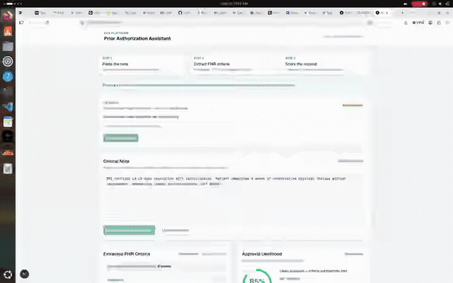

# ePA Platform

**Security-first electronic Prior Authorization (ePA)** — FHIR R4 · SMART on FHIR foundations · forensic audit trail · Provider Assistant dashboard.

> **Synthetic data only.** Do not process real PHI until Business Associate Agreements (BAAs) and production KMS are in place.

---

## Why this exists

Manual prior authorization burns clinician and revenue-cycle time, drives denials from incomplete packets, and collides with **CMS-0057-F** interoperability expectations. This platform demonstrates an end-to-end path: clinical note → structured FHIR criteria → **approval likelihood score** + **documentation gaps**, behind enterprise-grade session and audit controls.

---

## Product walkthrough (~13 seconds)

GitHub renders this as an inline GIF (the original 9 MB WebM was too large for GitHub’s file viewer):



| Format | Size | Link |
|--------|------|------|
| GIF (README / preview) | ~1.9 MB | [`docs/demo/provider-dashboard-demo.gif`](docs/demo/provider-dashboard-demo.gif) |
| MP4 | ~1.6 MB | [`docs/demo/provider-dashboard-demo.mp4`](docs/demo/provider-dashboard-demo.mp4) |
| WebM | ~810 KB | [`docs/demo/provider-dashboard-demo-small.webm`](docs/demo/provider-dashboard-demo-small.webm) |

Also embedded on the local dashboard at `http://localhost:3000`.

---

## Quick Start

### Prerequisites

- Docker (PostgreSQL) or local Postgres
- Python 3.11+
- Node.js 20+

### 1. Database

```bash
docker start epa-postgres 2>/dev/null || docker run -d --name epa-postgres \
  -e POSTGRES_USER=epa -e POSTGRES_PASSWORD=changeme \
  -e POSTGRES_DB=epa_platform -p 5432:5432 postgres:16-alpine
```

### 2. Backend

```bash
cd backend
python -m venv venv && source venv/bin/activate
pip install -e ".[dev]"
cp -n .env.example .env
alembic upgrade head
uvicorn app.main:app --reload --port 8000
```

### 3. Frontend

```bash
cd frontend
cp -n .env.example .env.local
npm install
npm run dev
```

Open **http://localhost:3000** — the UI loads a **demo preview** (sample note + 85% likelihood) so the screen is never empty. Connect an OAuth token to run the live pipeline.

### 4. Tests

```bash
cd backend && source venv/bin/activate
python -m pytest tests/test_security_phase15.py tests/test_phase2_pipeline.py -v
```

---

## Security & Compliance First

| Control | Summary |
|---------|---------|
| JWT / JWKS (RS256) | Minimal claims; scopes/roles from server-side grants |
| OAuth2 + PKCE | SMART-oriented authorize / token / introspect / revoke |
| BFF + httpOnly cookies | Browser never stores Bearer tokens in `localStorage` |
| CSP / frame deny | Hardened Next.js response headers |
| Audit chain | SHA-256 hash chain + HMAC segment for non-repudiation |
| Envelope encryption | Mock KMS scaffolding for PHI field wrapping |

Details: [`PHASE_1.5_SECURITY_REMEDIATION.md`](PHASE_1.5_SECURITY_REMEDIATION.md), [`docs/compliance/`](docs/compliance/)

---

## Architecture (high level)

```
Browser → Next.js BFF (/api/analyze, /api/auth/session)
              ↓ Bearer (server-side only)
         FastAPI → NLP extract → Rules engine → Audit log (HMAC)
              ↓
         PostgreSQL
```

Phase docs: [`PHASE_2_CORE_PIPELINE.md`](PHASE_2_CORE_PIPELINE.md) · [`PHASE_3_DASHBOARD.md`](PHASE_3_DASHBOARD.md)

---

## Request a Design Partnership

We are seeking mid-sized **regional health plans** and **independent specialty provider networks** as design partners.

- One-pager: [`docs/ONE_PAGER.md`](docs/ONE_PAGER.md)
- Outreach template: [`docs/OUTREACH_EMAIL_TEMPLATE.md`](docs/OUTREACH_EMAIL_TEMPLATE.md)

**Next steps for partners:** 20-minute walkthrough → sandbox workflow validation → SMART on FHIR launch scoping (Track B).

Replace contact placeholders in those docs with your email / LinkedIn before sending.

---

## Roadmap snapshot

| Phase | Status |
|-------|--------|
| 1 / 1.5 Architecture & security hardening | Done (CONDITIONAL GO — synthetic) |
| 2 NLP + prediction (synthetic) | Done |
| 3 Provider dashboard + screencast | Done |
| 4 Demo packaging / EHR plan / compose | Planned |
| 5 Design-partner outreach | **This package** |
| Track B Live FHIR sandbox | Planned |
| Production KMS + BAAs + cloud | Gate for real PHI |

---

## License

Proprietary — all rights reserved unless otherwise stated.
