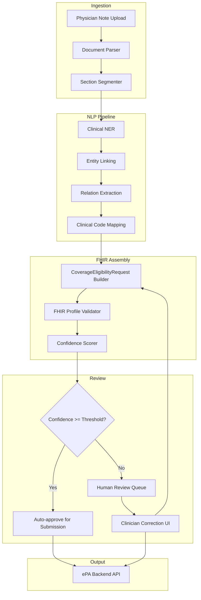
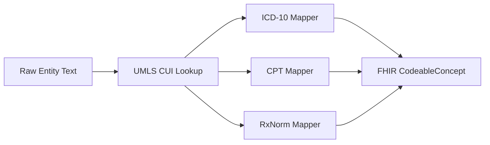
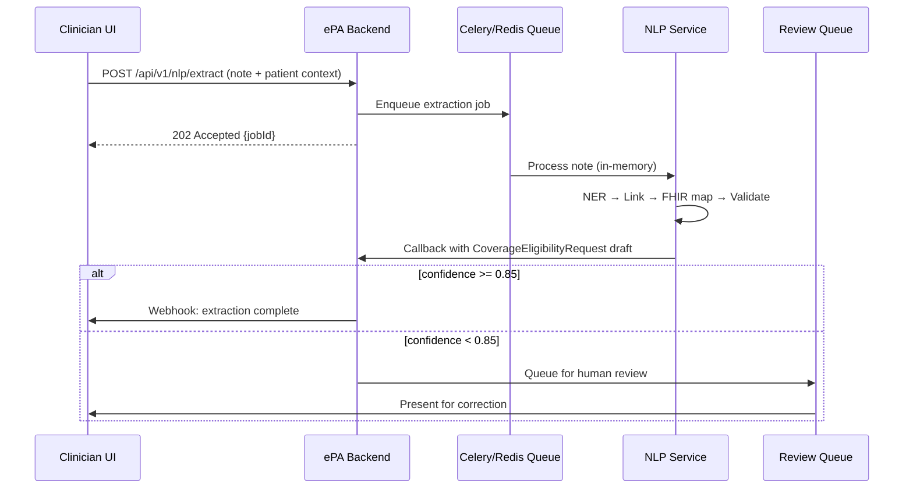

# Clinical NLP Extraction Module — Architecture

## Overview

The Clinical NLP module transforms unstructured physician notes (Progress Notes, H&P documents) into structured FHIR R4 `CoverageEligibilityRequest` resources for the ePA platform. It operates as an isolated microservice with strict PHI handling boundaries.

## Design Goals

- Extract clinical entities required for prior authorization (diagnoses, procedures, medications, clinical justification)
- Map extracted entities to FHIR R4 resources with terminology bindings (ICD-10, CPT, RxNorm)
- Maintain HIPAA compliance through in-memory processing, no raw note persistence, and audit logging
- Support human-in-the-loop review before submission to payer

## High-Level Architecture



## Pipeline Stages

### 1. Ingestion & Preprocessing

| Component | Technology | Notes |
|-----------|-----------|-------|
| Document Parser | `python-docx`, `pdfplumber`, HL7 C-CDA parser | Accept DOCX, PDF, FHIR DocumentReference |
| Section Segmenter | Rule-based + BioClinicalBERT classifier | Split into HPI, Assessment, Plan, Medications |
| De-identification (optional) | Microsoft Presidio / CliniDeID | For non-production analytics only; production processes identified PHI in secure enclave |

### 2. Clinical Named Entity Recognition (NER)

**Recommended approach for HIPAA**: Self-hosted clinical NLP models within the VPC — no PHI sent to external LLM APIs.

| Model | Use Case | Deployment |
|-------|----------|------------|
| **ClinicalBERT / BioClinicalBERT** | Primary NER for conditions, procedures, medications | Hugging Face Transformers on GPU instance |
| **spaCy `en_core_sci_sm`** | Fast baseline NER, date/dosage extraction | CPU fallback |
| **scispaCy** | Abbreviation resolution, UMLS linking | Co-deployed with spaCy |
| **LLM with guardrails (Phase 2+)** | Complex reasoning for clinical justification | Self-hosted Llama 3 / Mistral in private VPC with structured output schema; never external SaaS for PHI |

Entity types extracted:
- `CONDITION` → maps to FHIR `Condition` (ICD-10-CM)
- `PROCEDURE` → maps to FHIR `Procedure` (CPT/HCPCS)
- `MEDICATION` → maps to FHIR `MedicationRequest` (RxNorm)
- `DOSAGE`, `FREQUENCY`, `DURATION`
- `CLINICAL_JUSTIFICATION` → free text for PA supporting documentation

### 3. Entity Linking & Code Mapping



- **UMLS Metathesaurus** for concept normalization
- **Confidence threshold**: 0.85 for auto-mapping; below threshold → human review flag
- Cache terminology lookups in Redis (no PHI in cache keys)

### 4. FHIR Resource Assembly

Output `CoverageEligibilityRequest` structure:

```json
{
  "resourceType": "CoverageEligibilityRequest",
  "status": "draft",
  "purpose": ["auth-requirements", "benefits"],
  "patient": { "reference": "Patient/{id}" },
  "insurer": { "reference": "Organization/{payer-id}" },
  "item": [
    {
      "productOrService": { "coding": [{ "system": "http://www.ama-assn.org/go/cpt", "code": "27447" }] },
      "diagnosis": [{ "diagnosisCodeableConcept": { "coding": [{ "system": "http://hl7.org/fhir/sid/icd-10-cm", "code": "M17.11" }] } }]
    }
  ],
  "supportingInfo": [
    { "reference": { "reference": "DocumentReference/{note-id}" } }
  ]
}
```

Supporting resources created as contained or referenced:
- `Condition` (diagnoses)
- `Procedure` (requested services)
- `MedicationRequest` (requested drugs)
- `DocumentReference` (source note metadata, not raw text)

### 5. Validation

- **FHIR Validator**: HL7 FHIR Validator CLI against `epa-eligibility-request` profile
- **Business rules engine**: Required fields for payer-specific PA criteria
- **Terminology validation**: Code system membership checks

## Integration with Backend



### Proposed API Endpoints (Phase 2)

| Method | Path | Description |
|--------|------|-------------|
| POST | `/api/v1/nlp/extract` | Submit note for async extraction |
| GET | `/api/v1/nlp/extract/{jobId}` | Poll extraction status/result |
| PUT | `/api/v1/nlp/extract/{jobId}/review` | Submit clinician corrections |

## PHI Handling Requirements

| Requirement | Implementation |
|-------------|---------------|
| No raw note logging | Notes processed in-memory only; discarded after FHIR output |
| No external API calls with PHI | All models self-hosted in HIPAA-eligible cloud (AWS HIPAA, Azure Health) |
| Encryption in transit | mTLS between NLP service and backend |
| Encryption at rest | Only structured FHIR output persisted (already encrypted via backend PHI layer) |
| Audit trail | Log extraction events (job ID, user, timestamp, entity counts) — never note content |
| Minimum necessary | Extract only entities needed for PA; strip unrelated clinical narrative |

## Human-in-the-Loop Review

- Side-by-side UI: source note (highlighted entities) ↔ structured FHIR preview
- Clinician can accept, edit, or reject each extracted entity
- All corrections logged for model retraining (de-identified correction pairs)
- Review required when:
  - Any entity confidence < 0.85
  - Multiple codes mapped to single entity
  - Missing required PA fields detected

## Model Training & Improvement

- **Feedback loop**: Clinician corrections → de-identified training pairs → periodic model fine-tuning
- **Evaluation metrics**: Entity F1, code mapping accuracy, FHIR validation pass rate
- **A/B testing**: Shadow mode for new model versions before promotion

## Technology Stack Summary

| Layer | Technology |
|-------|-----------|
| Orchestration | Celery + Redis (async job queue) |
| NLP Engine | BioClinicalBERT + scispaCy + UMLS |
| FHIR Tools | `fhir.resources` (Python), HL7 Validator |
| Infrastructure | Docker/K8s, GPU node pool for inference |
| Monitoring | Prometheus metrics (latency, confidence distribution) — no PHI in metrics |

## Phase 1 Deliverable Status

This document defines the architecture. Implementation is scoped for Phase 2 after API and compliance scaffolding are validated.
